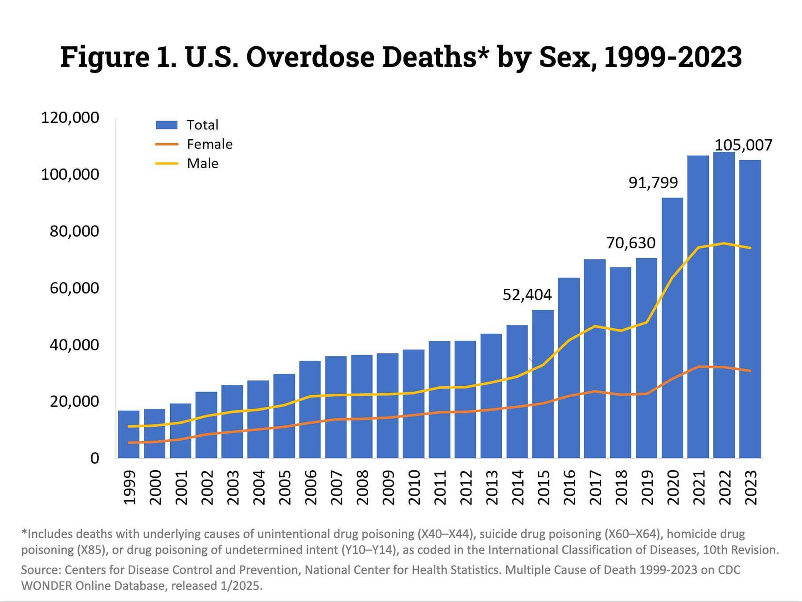

# Relationships Between Socioeconomic and Demographic Variables and Drug Overdose Death Rates

Over half of Americans report knowing someone personally who has died of an overdose [@aac_degrees]. Drug overdose deaths remain a major public health crisis in the United States, affecting individuals across all socioeconomic, demographic, and geographic backgrounds. Overdose mortality rates have risen steadily since at least 1999, with a dramatic upsurge seen in the past decade (see Figure 1). While this issue is often discussed in broad terms, frequently framed as a uniform epidemic affecting the population as a whole (e.g., the "opioid epidemic"), the underlying drivers of overdose risk are complex and multifaceted. In particular, socioeconomic factors such as income, poverty, and educational attainment may play an important role in shaping the prevalence and distribution of overdose deaths across the country. Understanding these relationships is critical for both informing policy and targeting interventions to protect vulnerable groups.

[@nida_overdose_graph]

This study aims to answer the following questions:

1.  How are median household income, poverty rate, and educational attainment related to drug overdose death rates in states, and do these relationships vary across different drugs?

2.  Does the effect of poverty on overdose death rates depend on educational attainment of the population?

3.  Are there significant differences in overdose death rate between males and females?

4.  Are there significant differences in overdose death rate between different age groups?
